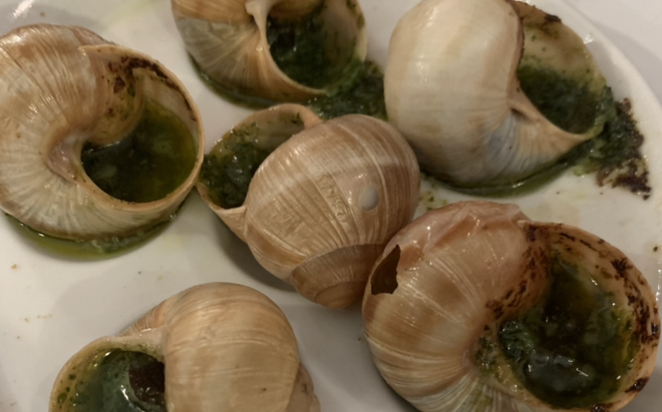

+++
title = "Website via Hugo Book and deployed by Github Action"
+++ 


# In Windows10, build personal website via Hugo-book and Github Actions

This blog is about how to use Hugo to create the local website, and then deploy it on GitHub via Github Action. Everything is step by step.




## Prerequisites
1. Git
2. Windows 10
3. VScode
4. Github account


## Install Hugo
1. In Windows10, right click **Windows Powershell** and click **run as administrator**.
2. Refer to [How to install chocolatey in Windows](https://www.youtube.com/watch?v=-5WLKu_J_AE) to **install chocolatey**.
3. Refer to [Install Hugo on Windows](https://gohugo.io/installation/windows/) to **install Hugo** by 
```
choco install hugo-extended
```
4. Make sure Hugo works well by
```
hugo version
```
and we will get the following
```
hugo v0.123.7-312735366b20d64bd61bff8627f593749f86c964+extended windows/amd64 BuildDate=2024-03-01T16:16:06Z VendorInfo=gohugoio
```


## Create the website using Hugo themes
For example, I want to locally work on my website in `C:\myweb` folder. Still in **Windows Powershell**, 
1. Navigate back to `C:` driver, and create a new folder by typing `mkdir myweb`.
2. Create the website by 
```
hugo new site Blogs
```
3. `cd Blogs` 
4. `git init` 
5. Refer to [Hugo Book Theme](https://themes.gohugo.io/themes/hugo-book/) to use hugo-book theme by
```
git submodule add https://github.com/alex-shpak/hugo-book themes/hugo-book
```
6. Till now, if we run `hugo server`, we will get a plain website locally.

In **VS code**, open `Blogs` folder.

7. In `C:/myweb/Blogs/themes/hugo-book/exampleSite/content.en/`, copy `docs` folder, `posts` folder and `_index.md` file to `C:/myweb/Blogs/content/`.
> Why I don't copy the `menu` folder?\
> Because I found `menu` folder doesn't work when I modified the website as I needed.
> We can customize the order of menus in leftbar by adding weight in the `name.md` file. For example, in each `name.md` file, the parameter `weight` determine the order of menues.
> ```
> ---
> weight: 1
> title: One name.md file
> ---
> ```

8. Run `hugo server` again, we will see a more well-done website.

## Deploy on Github by Action
1. Create a **public** Github repository.
> For example, if this repository's name is **Blogs**, your website link will be like this *https://huilin-li.github.io/Blogs/*
2. Still in **Windows Powershell**, push your local work to this repository by
```
cd C:/myweb/Blogs
git add .
git commit -m "update"
git branch -M main
git remote add origin https://github.com/Huilin-Li/Blogs.git
git push -u origin main
```
3. Visit your GitHub repository. From the main menu choose **Settings** > **Pages**. In the center of your screen you will see this:



4. Change the Source to `GitHub Actions`.
5. Click `Configure` as the highlight in this picture:




6. Go to [Host on GitHub Pages](https://gohugo.io/hosting-and-deployment/hosting-on-github/), copy the `yaml` file in `step 6` to `Blogs/.github/workflows/hugo.yaml`, and commit changes.
7. As **Step8**, **Step9**, **Step10** in [Host on GitHub Pages](https://gohugo.io/hosting-and-deployment/hosting-on-github/), the deloyment is done. 🎉

## Update website
Add more contents in `C:/myweb/Blogs/content/` folder, and then `git push` to Github repository. `Github Action` will automaticaly update new contents in `https://huilin-li.github.io/Blogs/`.


## References
1. [How to install chocolatey in Windows](https://www.youtube.com/watch?v=-5WLKu_J_AE)
2. [Hugo with Git Hub Pages on Windows](https://www.youtube.com/watch?v=JvvFd1JBeQU&t=127s)
3. [Using GitHub Pages with Actions to deploy Hugo sites in seconds - Tommy Byrd // HugoConf 2022](https://www.youtube.com/watch?v=Z_7RIuf_Z-Q)
4. [Hugo Book Theme](https://themes.gohugo.io/themes/hugo-book/)
5. [Host on GitHub Pages](https://gohugo.io/hosting-and-deployment/hosting-on-github/)
6. [【Hugo】hugo-book主题使用](https://hongmao.run/blog/post/010-hugo-book/)

 